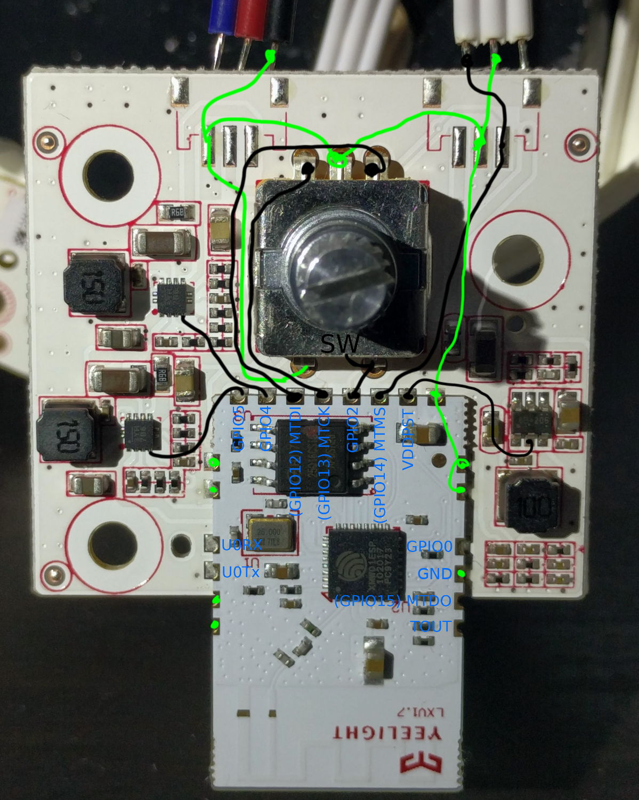

xiomi-desk-lamp-open-firmware
=============================

The xiaomi desk lamp is a modern IoT device, that uses the ESP8266 microcontroller. This project provides an open source firmware replacement this lamp. It provides basic functionality:
 * Toggle on/off (press and release button)
 * Dimming (rotate button while on)
 * Change color temperature (press and rotate button while on)

Doesn't provide any IoT features at the moment. But who needs IoT features of a desk lamp?!

Hardware
--------
You can open the lamp by unscrewing the [three screws](img/screws.jpg) at the bottom of the lamp (under the rubber feets). Then you can see [this](img/bottom.jpg). The main pcb should look like this:

The Hardware basically consists of an ESP8266 Module, some regulators and a rotary encoder. The ESP8266 controls two switching regulators via PWM to set the brightness of the cold and warm LEDs. For some reason the `esptool.py` detects the ESP8266 as ESP8285, even trough there is an external flash chip.

Enter Flashing Mode
-------------------
1. Solder Connections to `U0RX`, `U0TX`, `GPIO0` and `GND` on main pcb.
2. Connect `U0RX`, `U0TX` and `GND` to USB serial adapter, pull `GPIO0` to `GND`.
3. Toggle Power

Backup
------
Before starting you might want to backup the original firmware. Be carefull, this backup contains settings like your wifi credentials! Make sure to check the flash size (just in case there are other variants).

    esptool.py --port /dev/ttyUSB0 read_flash 0x00000 0x200000 image.bin
You can write the backup back with:

    esptool.py --port /dev/ttyUSB0 write_flash 0x00000 image.bin

Build and Install
-----------------

Install [esp-open-sdk](https://github.com/pfalcon/esp-open-sdk), setup PATH enviroment variable (e.g. `export PATH=/opt/esp-open-sdk/xtensa-lx106-elf/bin:$PATH`)

Build the firmware:
	
	mkdir bin
	cmake ../src/
	make

Flash the firmware:

	make flash

FAQ
---
Q: Why do you buy an IoT desk lamp?  
A: I like the design of the lamp, but not the communication with third party internet servers.

Q: Can you please add IoT features to your firmware?  
A: I'm not personally intrested in theses features. Feel free to open a pull request.
